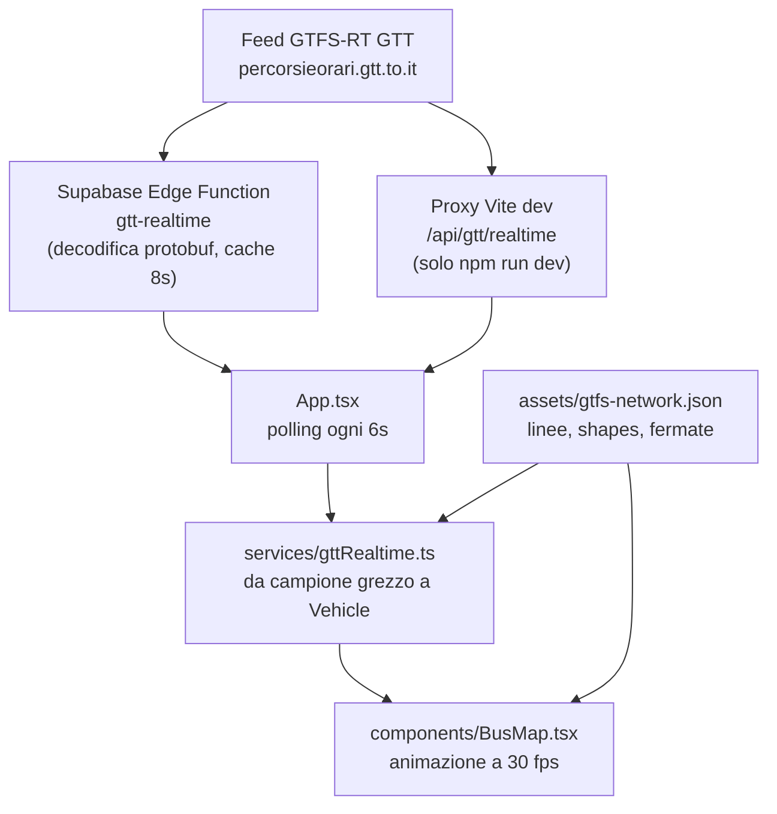

# BusRadar · riferimento di progetto

Questo è il documento da leggere per primo prima di toccare BusRadar, sia per Claude Code sia per Codex. Serve a due cose: capire com'è fatto il progetto senza rileggere tutto il codice, e verificare in che stato si trova prima di proporre una modifica.

Gli altri documenti restano validi e più specifici:

| documento | contenuto |
| --- | --- |
| [`docs/handoff.md`](handoff.md) | **da leggere per primo**: stato lasciato dall'agente precedente, lavoro in sospeso, verifiche mancanti |
| [`AGENTS.md`](../AGENTS.md) | regole operative per gli agenti, controlli obbligatori, sicurezza |
| [`docs/cloud-workflow.md`](cloud-workflow.md) | flusso GitHub, lavoro in tandem, uso da iPhone |
| [`README.md`](../README.md) | presentazione del progetto e note legali |
| [`README_REALTIME.md`](../README_REALTIME.md) | strumenti e checklist per il realtime |
| [`docs/gtfs-static-validation.md`](gtfs-static-validation.md) | validazione del GTFS statico GTT |
| [`docs/product-spec-v0.1.md`](product-spec-v0.1.md) | specifica storica della v0.1, **superata** (vedi «Incoerenze note») |

Ultimo allineamento di questo documento: 2026-08-09, versione applicativa v0.2.31.

---

## 1. Cos'è BusRadar oggi

Webapp standalone mobile-first che mostra i mezzi GTT di Torino su mappa, in stile live transit map. Non è un servizio ufficiale GTT, MaTO, 5T o del Comune di Torino: i dati realtime sono letti in modalità civic-tech tramite un proxy tecnico.

- **Stack**: React 19, TypeScript, Vite 6, MapLibre GL 5, CSS custom. Nessun framework CSS, nessuno state manager esterno.
- **Posizioni mezzi**: GTFS-RT Vehicle Positions GTT, tramite Supabase Edge Function.
- **Rete (linee, tracciati, fermate)**: GTFS statico GTT, pre-elaborato in JSON e servito come asset.
- **Backend**: solo due Edge Function Supabase. Nessun database, nessuna sessione, nessuna autenticazione.
- **Scraping**: assente. Nessun endpoint privato, nessuna chiave nel repository.
- **Deploy**: GitHub Pages su `https://trailpress.github.io/BusRadar/`.

---

## 2. Architettura e flusso dei dati



Il passaggio che conta davvero, e dove si concentrano quasi tutti i bug visivi, è la catena **campione grezzo → `Vehicle` → fotogramma animato**.

### 2.1 Dal feed al `Vehicle`

Tutto in `frontend/src/services/gttRealtime.ts`, funzione `toVehicle`.

1. **Identità**: `vehicleId` normalizzato da `vehicle.id` o `vehicle.label`; il numero di parco viene riconosciuto solo se compatibile con il catalogo flotta, altrimenti il mezzo resta «modello non identificato».
2. **Velocità** (`observedSpeed`): si preferisce la velocità del feed; se assente si calcola dallo spostamento tra due campioni, accettando solo intervalli tra 5 e 180 s e velocità sotto 90 km/h.
3. **Aggancio alla shape** (`terminalEstimate`): tra le varianti GTFS della linea si sceglie quella che minimizza distanza dal punto e scarto di direzione, con un forte bonus di permanenza sulla shape già in uso. Il mezzo è considerato agganciato entro 55 m (70 m per gli extraurbani blu).
4. **Compensazione della latenza** (`compensateFeedLatency`): se agganciato, il punto viene proiettato in avanti lungo la shape per recuperare l'età del campione. Vedi §4.

   L'età si misura dal timestamp del veicolo, **con ricaduta sul timestamp dell'header del feed** quando il veicolo non ne porta uno, e **con un pavimento** pari al ritardo che il feed non dichiara. Quest'ultimo è necessario perché GTT marca i campioni come appena misurati: la scheda mezzo mostrava un recupero di 26 m su una vettura visibilmente indietro di un minuto, e a 15 km/h quei 26 m implicano un'età dichiarata di 4 secondi contro i 55 reali. Il ritardo esiste ma non è deducibile dai dati, quindi va assunto — e se ne recupera **solo una parte, di proposito**. Proiettare l'intero ritardo è stato provato e ha peggiorato la mappa: la proiezione presume che il mezzo mantenga il passo recente, un bus urbano non lo mantiene, e `routeMotion` si rifiuta di far tornare indietro un marker. Ogni sovrastima diventava quindi un fotogramma intero con il marker fermo mentre il mezzo reale proseguiva, e la mappa risultava **più bloccata e più indietro** che senza compensazione. Correggere una frazione del ritardo lo riduce senza ricomprarselo in stalli. Non è un dettaglio: senza quella ricaduta un campione privo di timestamp viene creduto appena generato, la compensazione non si attiva del tutto perché agisce solo su un'età nota, e il marker resta indietro di un intero ciclo di feed.
5. **Uscita**: posizione finale, bearing, progresso sulla linea, capolinea stimato, ETA, previsioni di fermata dai Trip Update.

### 2.1.1 Arrivi alle paline

Gli arrivi mostrati toccando una palina vengono da `fetchGttStopArrivalsInfo`, che unisce due fonti: i Trip Update GTFS-RT e, per le linee senza dato realtime, gli orari programmati del GTFS statico.

L'aggancio di un orario alla palina giusta segue una gerarchia precisa, e va rispettata:

1. Se l'aggiornamento porta un `stopId` esplicito, quello decide, **anche in negativo**: un id diverso significa un'altra fermata.
2. Solo se manca l'id si può ricadere sull'ordinale (`stopSequence`).

Il secondo passo è un ripiego, mai un'alternativa al primo. Una palina occupa in media 1,29 posizioni diverse sulla stessa linea, e fino a 9 nei casi peggiori, perché le sequenze di tutte le varianti e di entrambe le direzioni finiscono sotto la stessa chiave. Trattare l'ordinale come prova di identità faceva comparire alla palina gli orari di altre fermate della stessa linea.

Gli orari programmati arrivano invece dai bucket per fermata descritti in §5, dove l'id fermata è l'unica chiave: lì il ripiego sull'ordinale non serve e non esiste. Passano poi dal calendario di servizio (`serviceRunsToday`): senza quel filtro la stessa corsa comparirebbe più volte, una per ogni calendario che la definisce.

Il pannello di una palina non deve mai dipendere dal realtime per mostrare l'orario: gli orari programmati sono un asset locale e restano disponibili anche con il proxy irraggiungibile.

**Cosa si mostra, e cosa no.** Un pannello risponde a «cosa passa adesso da qui», non espone l'orario completo. Le corse programmate vengono quindi prese da una finestra di **90 minuti**, con un massimo di **3 per linea**, così una linea ad alta frequenza non occupa tutti i posti e le linee notturne non compaiono accanto a un arrivo fra sette minuti. Se una sola linea serve la palina il limite si rilassa fino a 8 corse. Se nella finestra non passa nulla si mostrano le prime 4 corse successive, perché a servizio fermo l'orario di ripresa vale più di un pannello vuoto.

Gli orari del giorno dopo vanno etichettati. Il GTFS scrive i servizi notturni come `27:49`, non come «domani 03:49», quindi il giorno non si deduce dallo scostamento di data: va confrontata la data risultante con quella odierna.

### 2.2 Dal `Vehicle` al movimento sulla mappa

Tutto in `frontend/src/components/BusMap.tsx`.

Il polling produce campioni ogni 6 secondi, ma il feed GTT è tipicamente vecchio di circa un minuto. Il marker non salta da un campione all'altro: ogni aggiornamento apre un **fotogramma** (`VehicleFrame`) con posizione di partenza, arrivo e durata, e un loop `requestAnimationFrame` a 30 fps interpola tra i due.

- Se il mezzo è agganciato a una shape, l'interpolazione avviene **lungo il tracciato** (`routeMotion` + `interpolatePathState`), non in linea retta. Il bearing viene dalla geometria.
- `routeMotion` impedisce per costruzione la marcia indietro: il progresso non scende mai sotto quello già mostrato.
- Se non c'è aggancio, l'interpolazione è punto a punto e vale la protezione dal rumore GPS descritta in §4.

---

## 3. Mappa del repository

```text
BusRadar/
├── AGENTS.md                    istruzioni persistenti per gli agenti
├── README.md · README_REALTIME.md
├── docs/                        questo documento e gli altri riferimenti
├── .github/workflows/
│   ├── ci.yml                   Verify BusRadar, su ogni pull request
│   ├── deploy-pages.yml         build e pubblicazione, su push in main
│   └── generate-fleet-render.yml   render flotta, manuale per cluster
├── .devcontainer/               workspace GitHub Codespaces
├── supabase/functions/
│   ├── gtt-realtime/            proxy GTFS-RT pubblico
│   └── route-preview-config/    chiavi vista strada a runtime
└── frontend/
    ├── vite.config.ts           base /BusRadar/ + proxy realtime di sviluppo
    ├── scripts/                 generazione dati e verifiche
    ├── public/assets/           asset statici e dataset GTFS generati
    └── src/
```

### Dove intervenire, per tipo di modifica

| se devi toccare | vai in |
| --- | --- |
| movimento, animazione, marker, freccia, layer mappa | `src/components/BusMap.tsx` |
| trasformazione del feed, aggancio shape, ETA, velocità | `src/services/gttRealtime.ts` |
| polling, stato globale, navigazione tra schermate | `src/App.tsx` |
| schermate (mappa, linee, vetture, fermate, radar) | `src/screens/` |
| scheda vettura e dettaglio linea | `src/components/VehicleSheet.tsx`, `src/screens/LineDetailScreen.tsx` |
| riconoscimento flotta, livree, render dei mezzi | `src/data/gttFleetCatalog.ts`, `src/data/vehicleFleet*.ts` |
| calcoli geografici (distanza, bearing, progresso su path) | `src/utils/geo.ts` |
| vista strada lungo il percorso | `src/components/RouteStreetViewPlayer.tsx` |
| dataset GTFS statico | `scripts/generate-gtfs-network.mjs` |

### File più densi

`BusMap.tsx` è di gran lunga il file più grande del progetto e contiene sia la logica di animazione sia la definizione di tutti i layer MapLibre. `gttRealtime.ts` contiene l'intera trasformazione del feed. Sono i due punti in cui una modifica affrettata fa più danni.

---

## 4. Parametri di taratura del movimento

Sono i numeri che decidono quanto il movimento appare realistico. Vanno cambiati uno alla volta, verificando l'effetto sulla mappa reale: sono stati scelti in equilibrio tra loro.

### In `services/gttRealtime.ts`

| costante o soglia | valore | effetto |
| --- | --- | --- |
| `MAX_LATENCY_COMPENSATION_SECONDS` | 75 s | quanta età del campione viene recuperata proiettando in avanti |
| `LATENCY_COMPENSATION_LEAD_SECONDS` | 3 s | mira leggermente avanti, perché il marker raggiunge il bersaglio solo nei secondi successivi |
| `SPEED_AVERAGE_WINDOW_SECONDS` | 60 s | finestra della media di velocità, allineata al ritardo compensato e pesata sul tempo reale tra i campioni, non sul loro numero. **Simmetrica di proposito**: far entrare più in fretta i rallentamenti conta due volte le soste, che nella media già ci sono |
| `STOP_DWELL_SECONDS` | 15 s | quanto costa alla proiezione ogni fermata che attraversa. Senza, il mezzo veniva proiettato dritto attraverso la fermata che stava servendo. **Serve solo di ripiego**: quando il feed annuncia le fermate successive vince l'ancoraggio |
| `anchoredAdvanceMeters` | — | posiziona il mezzo interpolando fra il campione e la fermata che GTT dice che sta per raggiungere. È la sorgente preferita; la proiezione a velocità resta per le corse senza previsioni |
| `LATENCY_ADJUST_FRACTION` | 0,35 | quanta della velocità del mezzo la correzione può spendere per cambiare sé stessa. Il marker si muove quindi fra 0,65× e 1,35× la velocità del mezzo: mai all'indietro, mai a scatti |
| velocità usata per la proiezione | media mobile, non istantanea | proiettare un minuto di percorso con la velocità di un singolo istante faceva oscillare il recupero fra zero e 400 m sullo stesso mezzo, a ogni ripartenza da fermata |
| `ASSUMED_UNDECLARED_FEED_DELAY_SECONDS` | 35 s | ritardo che il feed GTT **non dichiara**: i campioni arrivano marcati come appena misurati, ma la posizione è di circa un minuto prima. È l'unica costante tarata su un'osservazione dalla strada, non sui dati — vedi la tabella qui sotto |
| `MAX_LATENCY_COMPENSATION_METERS` | 700 m | tetto assoluto alla proiezione |
| `LATENCY_COMPENSATION_CONFIDENCE` | 0,90 | margine contro l'overshoot: la stima assume velocità costante, il mezzo invece frena |
| bonus di permanenza sulla shape | −95 entro 140 m | evita che andata e ritorno si scambino tra un campione e l'altro |
| `snapLimitMeters` | 55 m, 70 m extraurbani | oltre questa distanza il mezzo non è agganciato alla shape |
| soglia velocità per la compensazione | 1,5–75 km/h | fuori da questa fascia non si proietta |

La compensazione è limitata anche dalla distanza residua al capolinea: un mezzo non viene mai proiettato oltre la fine della sua corsa.

#### Cosa contiene davvero il feed GTT

Misurato sull'endpoint del proxy il **2026-08-10 alle 15:59 UTC**, 294 mezzi. Sono i primi dati letti dal feed vivo invece che dedotti da screenshot, e correggono tre supposizioni:

| campo | cosa arriva davvero |
| --- | --- |
| `timestamp` del veicolo | presente, con età dichiarata di **10-30 s** nel caso tipico (non ~3 s come si era dedotto), e una coda di campioni fino a **5 minuti** |
| `speed` | **sempre 0**, su tutti e 294 i mezzi. La velocità del feed è inutilizzabile: si ricava solo dallo spostamento fra campioni |
| `tripId` | **sempre vuoto**. Un Trip Update non potrà mai essere agganciato per corsa: resta solo l'aggancio per matricola |
| `lat`/`lon` | alcuni mezzi a `0,0`, correttamente scartati |
| `vehicleLabel` | a volte diverso da `vehicleId` (1235 → 16235, 1305 → 19005) e a 5 cifre, fuori da ogni gruppo del catalogo flotta: quei mezzi restano «modello non identificato» finché la serie non è verificata su fonti attendibili |

**Nella media di velocità entrano solo le misure.** È il difetto che teneva spenta la compensazione su gran parte dei mezzi, e che ha reso vana buona parte della taratura precedente: la `speed` del feed è sempre zero, quindi la velocità si ricava dallo spostamento fra due campioni; ma l'app interroga il proxy ogni 6 secondi mentre GTT rinfresca un mezzo ogni 15 circa, e nei cicli senza campione nuovo veniva versato uno zero nella media con peso 0,1. Fra due misure vere passano due o tre cicli, quindi **la media convergeva a una frazione della velocità reale**, il cancello a 1,5 km/h la scartava, e la scheda dichiarava «mezzo fermo o troppo lento» su vetture in servizio.

Zero significa «non lo so», non «sta fermo». Due conseguenze da non rimuovere: il campione di riferimento si sposta **solo quando è servito a misurare** (altrimenti la base di misura viene distrutta prima di raggiungere i 5 secondi necessari), e uno zero **misurato** viene accettato, perché un timestamp che avanza senza movimento è l'osservazione di un mezzo fermo.

`npm run smoke:map --feed-mobile` riproduce proprio quel disallineamento — feed che rinfresca ogni 15 s con `speed` a zero, polling ogni 6 — e verifica che il mezzo tracciato risulti a 30 km/h invece che fermo.

**Il ritardo non dichiarato si somma all'età dichiarata, non la sostituisce.** Con un pavimento, un campione che si dichiara già vecchio di 40 s non riceveva alcuna correzione, come se per lui la tubatura fra misura e lettura non esistesse — e quei campioni nel feed reale ci sono. Nel caso tipico i due modelli coincidono (15+20 = 35, il valore tarato dalla strada), quindi il cambiamento non sposta la mappa di tutti i giorni.

#### Taratura del ritardo non dichiarato

Il feed non dice quanto è vecchio: i campioni arrivano marcati come appena misurati. Il valore va quindi trovato guardando la mappa accanto alla strada, un passo alla volta. Quello che si è visto finora:

| pavimento | recuperati | osservato sulla mappa |
| --- | --- | --- |
| 0 s | 3 s | in ritardo di tutto il minuto |
| 25 s | 25 s | in ritardo di 30-35 s, movimento fluido |
| 35 s | 34 s | **valore attuale**; senza le due correzioni sotto: recupero in un solo salto, poi attesa un centinaio di metri oltre la fermata |
| 50 s | 48 s | marker che si bloccano: peggio che non compensare affatto |

Il blocco a 50 s non è un caso limite ma il meccanismo stesso: se la proiezione supera la posizione vera, la soglia di marcia indietro in `routeMotion` tiene fermo il marker finché il mezzo reale non lo raggiunge. **Proiettare troppo costa più che proiettare poco.**

#### Corse non accertate

Quando il feed realtime tace su un'intera linea, le sue corse vengono disegnate **dall'orario programmato** e dichiarate non accertate. Non sono mezzi osservati: sono corse previste, e una corsa soppressa o un mezzo guasto apparirebbero comunque.

**La regola per generarle è deliberatamente stretta: una linea con anche un solo mezzo tracciato non ne produce nessuna.** Se il feed copre la linea, una corsa che non vi compare è probabilmente una corsa che non sta circolando, e disegnarla sarebbe inventare un mezzo. Solo il silenzio completo su una linea giustifica il ricorso all'orario.

**Vengono calcolate prima di arrendersi a un feed vuoto.** Calcolarle dopo le rendeva inerti proprio nel caso per cui esistono: a feed muto si usciva dalla cache o senza nulla, e la mappa restava con i tracciati e nessun mezzo sopra. Non finiscono invece nella cache dello snapshot: una posizione prevista vale per l'istante in cui è stata calcolata, e ripescarla cinque minuti dopo sarebbe falsa.

**Il ritardo di linea viene sottratto quando è noto.** Il feed delle previsioni può rispondere anche quando quello delle posizioni tace: porta lo scarto fra orario previsto e programmato, ed è l'unico modo di sapere che una corsa è in ritardo senza vederla. Senza questa correzione una corsa programmata resta per definizione **davanti** a un mezzo in ritardo, e si allontana man mano che il ritardo cresce. Si usa la mediana per linea, non la media: un solo aggiornamento aberrante sposterebbe tutte le corse.

**La lunghezza della shape si somma, non si proietta.** Ricavarla proiettando l'ultimo punto sul percorso sembra equivalente e non lo è: su una linea ad anello l'ultimo punto coincide col primo e la proiezione restituisce zero, mettendo ogni corsa di quella linea al capolinea. Succede su una variante su 602 — abbastanza raro da passare inosservato, che è ciò che lo rende insidioso.

**Ogni partenza appartiene a una variante sola.** Gli orari per fermata non dicono a quale: al capolinea si legge solo «la linea 1510 parte alle 8:12». Preso alla lettera, ogni ramo che condivide quel capolinea rivendicava tutte le partenze della linea — su 485 partenze della 1510, **387 finivano a più varianti** — e la mappa mostrava cinque corse ammassate in cento metri. Il generatore assegna quindi ogni partenza al ramo più completo: è una convenzione dichiarata, non una verità ricavata dai dati, ed è una delle ragioni per cui queste corse restano «non accertate».

A valle resta una garanzia indipendente: **due corse della stessa linea non vengono mai disegnate a meno di 250 m l'una dall'altra.** Due calendari attivi nello stesso giorno possono ancora descrivere la stessa corsa due volte, e un ammasso di pallini identici sulla stessa strada è indistinguibile da un errore.

**Le previsioni non superano mai di numero le osservazioni**: il tetto è il numero di mezzi realmente rilevati, con un minimo di 120 perché un feed quasi muto continui a dire qualcosa. Con 294 mezzi nel feed e un tetto fisso di 400, la mappa risultava fatta più di stime che di rilevazioni, ed è così che è stata letta: «corse grigie ovunque». Il budget è poi distribuito con un massimo di 12 corse per variante. Senza il limite per variante una sola linea ad alta frequenza esauriva il budget e lasciava tutte le altre senza nulla.

Sono riconoscibili senza aprirle: pallino grigio con bordo tenue invece del colore di linea, sprite al 45% di opacità, e in tre punti dell'interfaccia la dicitura esplicita — «corsa non accertata · da orario» sulla mappa, «Corsa non accertata: posizione stimata dall'orario programmato, nessun dato in tempo reale» e «Tracciamento GTT: nessuno» nella scheda. Non entrano nel conteggio delle posizioni realtime.

**Come si ricostruisce una corsa.** Gli orari pubblicati sono indicizzati per fermata, senza id di corsa né numero d'ordine: una corsa si ottiene incatenando — si parte dal capolinea all'ora X e a ogni fermata si prende la prima chiamata successiva. L'aggancio può prendere la corsa sbagliata dove una fermata è servita nei due sensi, e **il controllo che lo smaschera è geometrico**: la velocità implicita fra due fermate, nota perché la distanza lungo la shape è nota. Fuori da 2–110 km/h l'aggancio viene scartato invece che creduto (sul dataset attuale: 145 254 tenuti, 2914 scartati).

Farlo a runtime costerebbe i bucket di tutte le fermate di ogni linea silenziosa, cioè 24 MB su un telefono. `npm run gtfs:runs` lo precalcola in `public/assets/scheduled-runs.json`: un profilo per variante — a quanti secondi dalla partenza il mezzo si trova a quale metro — più l'elenco delle partenze. **2,5 MB, 410 kB compressi**, chiesti solo quando servono. Va rigenerato insieme al dataset GTFS.

#### Il riquadro di copertura del realtime

I mezzi che cadono fuori da un riquadro geografico vengono scartati prima di arrivare alla mappa. **Il riquadro si misura dal dataset, non si scrive a mano.** Scritto a mano era 44,7–45,35 per 7,25–8,15: copriva la città e ritagliava la rete interurbana, che arriva a 44,39–45,55 per 7,14–8,46. Ne restavano fuori **1542 fermate su 7035**, e 38 linee ne avevano almeno una: i mezzi verso Ivrea, la Val di Susa o Asti sparivano dalla mappa a metà corsa.

Prima che la rete sia caricata vale un ripiego largo quanto il Piemonte, il cui compito è respingere solo le assurdità — una posizione a 0,0, un mezzo dichiarato in un altro paese. `npm run verify:routes` controlla che la rete vera stia dentro quel ripiego.

#### Gerarchia delle fonti che posizionano un mezzo

**La posizione GPS del feed è sempre l'ancora**, in ogni caso. Quello che cambia è come si copre il minuto che manca fra il campione e adesso, e si prende la prova migliore disponibile:

| ordine | fonte | cosa fornisce | quando si usa |
| --- | --- | --- | --- |
| 1 | previsione GTT per quella corsa | l'orario di arrivo alla prossima fermata | quando il TripUpdate porta un orario assoluto **oppure un ritardo**: nel feed GTT gli orari assoluti non arrivano, ma il ritardo sì, e sommato all'orario programmato ricostruisce l'orario mancante |
| 2 | orario programmato del tratto | quanto dura quel tratto di strada | quando il realtime tace su quella corsa |
| 3 | velocità recente del mezzo | la media mobile su 60 s | quando nessuna delle due è disponibile |

**Come si aggancia una previsione a un mezzo, e cosa manca nel feed.** Il `tripId` dei veicoli è vuoto su tutti, quindi l'aggancio avviene per matricola — e funziona: la scheda lo ha confermato, riportando «previsioni senza orario futuro» invece di «nessuna previsione». Quello che manca sono gli **orari assoluti**: GTT manda solo lo scarto rispetto al programmato. L'orario si ricostruisce quindi sommando il ritardo dichiarato all'orario programmato della prossima fermata, scegliendo fra le corse della linea la prima che, applicato il ritardo, deve ancora arrivare — l'intervallo fra corse è molto più lungo dell'incertezza sul ritardo, quindi è quella giusta.

Se anche il ritardo mancasse, la scheda lo direbbe («previsioni senza orario né ritardo»): la diagnosi resta leggibile invece di degradare in silenzio.

L'orario programmato contribuisce **solo il passo, mai l'orologio** quando si tratta della stima di ripiego. Usare gli orari assoluti metterebbe un mezzo in ritardo dove avrebbe dovuto essere; il rapporto fra due orari programmati dice quanto dura il tratto, e un mezzo in ritardo lo percorre più o meno allo stesso passo. Così il ritardo di esercizio si annulla da sé e non serve stimarlo.

Il passo si ricava dai bucket orari già pubblicati, accoppiando ogni partenza dalla fermata precedente con la prima chiamata successiva alla fermata seguente: fra due fermate consecutive la percorrenza è più breve dell'intervallo fra le corse, quindi quella chiamata è della stessa corsa. Le coppie oltre i 15 minuti sono scartate invece che credute.

**I bucket vengono scaldati due alla volta, con un tetto di 24** (`stopSchedule.ts`). L'insieme completo pesa 25 MB: scaricarlo per posizionare i marker disferebbe esattamente il problema che il bucketing ha risolto. L'orario quindi migliora la mappa man mano che le linee guardate si assestano, e mai in un colpo solo. La scheda del mezzo dichiara quale delle tre fonti lo ha posizionato.

#### Il banco di prova

`npm run simulate:latency` mette a confronto le varianti dell'algoritmo su un mezzo urbano in traffico irregolare, con un feed vecchio di un minuto che si dichiara fresco. Esiste perché il feed non è raggiungibile da ogni ambiente, e perché a un autobus vero non si può chiedere di ripetere la stessa manovra due volte.

**Le tre metriche vanno lette insieme, e nessuna variante vince su tutte.** Chi riduce il sorpasso paga in ritardo: il compromesso è reale e va scelto, non risolto.

| variante | davanti 5% | mediana | fermo max | punta 99% |
| --- | --- | --- | --- | --- |
| nessuna correzione, 25 s | 72 m | 121 m | 200 s | 13,4 m/s |
| nessuna correzione, 35 s | 118 m | 79 m | 210 s | 14,2 m/s |
| solo fermate a carico | 86 m | 98 m | 210 s | 18,8 m/s |
| solo limite alla variazione | 110 m | 87 m | 200 s | 12,6 m/s |
| limite + fermate, 35 s | 71 m | 116 m | 150 s | 12,0 m/s |
| passo da orario programmato | 69 m | 115 m | 130 s | 11,5 m/s |
| **in uso: ancorato alle previsioni, 35 s** | **47 m** | **113 m** | **90 s** | **11,9 m/s** |
| ancorato, pavimento 45 s | 74 m | 84 m | 130 s | 12,1 m/s |
| ancorato senza limite alla variazione | 62 m | 70 m | 90 s | 20,5 m/s |

Tre letture importano più delle altre.

**Le fermate a carico da sole peggiorano gli scatti** (18,8 m/s): accorciano la proiezione a strappi, man mano che una fermata entra o esce dal tratto proiettato, e servono il limite alla variazione per essere utili.

**L'ancoraggio domina tutto il resto su ogni asse insieme**, ed è l'unico cambiamento che modifica il meccanismo invece dell'ampiezza: le altre varianti estrapolano da una posizione vecchia di un minuto, questa interpola fra due istanti noti. Regge bene anche a previsioni sbagliate: portando l'errore da ±20 s a ±40 s il risultato quasi non si muove (46 m / 115 m). L'ancoraggio **non recupera il ritardo non dichiarato**: l'estremo vicino dell'interpolazione resta il campione vecchio creduto giovane, quindi il pavimento serve ancora.

**L'orario programmato batte la velocità stimata su ogni asse, ma di poco** (69 contro 71, 130 s contro 150). È un ripiego migliore, non un sostituto dell'ancoraggio realtime: vale la pena averlo perché copre le corse di cui il feed tace, non perché cambi la mappa da solo.

**Il pavimento a 45 s è il passo successivo se il ritardo dà più fastidio del sorpasso**: a parità di sorpasso con quanto c'era prima (74 m contro 71 m) toglie un quarto del ritardo. È una scelta fra due difetti, non un miglioramento gratuito, e va fatta guardando la mappa.

Se le costanti in `gttRealtime.ts` cambiano, vanno riallineate anche nello script: altrimenti il banco misura un algoritmo che non è più quello in produzione.

### In `components/BusMap.tsx`

| costante o soglia | valore | effetto |
| --- | --- | --- |
| `maxPlaybackSpeedMps` | 13,9 m/s tram · 15,3 m/s bus | velocità massima con cui un marker può essere animato |
| margine di recupero | 1,35× la velocità reale, minimo 5,5 m/s | quanto può «rincorrere» un marker rimasto indietro |
| `isPlausibleUpdate` | 900 m | oltre questa distanza il campione è trattato come teletrasporto e il marker salta |
| `isPositionJitter` | < 12 m con velocità < 3 km/h | i mezzi senza shape tengono la posizione invece di ballare sul rumore GPS |
| soglia marcia indietro in `routeMotion` | −10 m | sotto questa soglia il progresso resta fermo invece di tornare indietro |
| throttle di rendering | 33 ms | circa 30 fps per la sorgente dei mezzi |
| `ARROW_OFFSET_EMS` | 1,24 | distanza della freccia dal badge, in em |
| `BEARING_BASELINE_METERS` (`utils/geo.ts`) | 40 m | la direzione si misura fra il punto 40 m indietro e quello 40 m avanti, **non sul segmento corrente**. Le shape GTT cambiano direzione di 20° in media fra segmenti consecutivi, e di oltre 60° in un caso su otto: presa dal singolo segmento la freccia scattava a ogni vertice. Con la base, gli scatti oltre 45° spariscono e il 99° percentile scende da 59° a 14° |

**Le misure di una shape stanno in cache accanto all'oggetto** (`measurePath`). `interpolatePathState` e `routeProgressAtPoint` girano per ogni mezzo a ogni fotogramma: rimisurare i segmenti trenta volte al secondo per trecento marker porta un fotogramma a 155 ms, cioè a uno scatto visibile.

**Regola pratica.** Se i mezzi sembrano accelerare in modo innaturale, il problema è quasi sempre nella durata del playback, non nella compensazione. Se sembrano andare all'indietro, guarda prima l'aggancio alla shape e poi la compensazione. Se la freccia confonde, guarda `hasReliableHeading` e l'offset.

---

## 5. Dati GTFS statici

Il GTFS statico GTT viene pre-elaborato **fuori dalla build** e committato come asset.

```bash
cd frontend
GTFS_STATIC_DIR=/percorso/gtfs/estratto npm run gtfs:generate
```

Produce `public/assets/gtfs-network.json` (linee, varianti, shapes, fermate) e `public/assets/stop-schedule/` (orari programmati indicizzati per fermata).

Gli orari programmati **non** sono un file unico. La sorgente GTFS è organizzata per corsa, quindi rispondere a «cosa passa da questa palina» richiederebbe l'intero dataset nel browser: 42 MB di traffico e circa 107 MB di heap, pagati da ogni visitatore. Il dataset è quindi riorganizzato per fermata e diviso in 256 bucket:

- `stop-schedule/calendar.json`, circa 460 kB, condiviso da tutte le paline;
- `stop-schedule/<bucket>.json`, al massimo circa 210 kB, uno solo per palina aperta.

Il bucket si ricava dall'id fermata con un hash FNV-1a, definito in `scripts/stop-schedule.mjs` e rispecchiato in `src/services/stopSchedule.ts`. **Le due implementazioni devono restare identiche**, altrimenti una palina chiede il bucket sbagliato e risulta senza corse.

Se serve ricostruire i bucket da un vecchio file monolitico, senza rileggere la sorgente GTFS, c'è `npm run gtfs:shard`.

Stato attuale, verificato da `npm run verify:routes`: **223 linee, 894 direzioni, 894 varianti GTFS**, nessuna direzione sostituita da un duplicato più corto.

La rete pesa circa **6 MB** e viene caricata all'avvio; l'insieme dei bucket pesa circa **25 MB** nel repository, ma il browser ne scarica uno solo per volta. Tutto è versionato. I dataset vanno rigenerati solo quando GTT pubblica un feed nuovo, e la rigenerazione va accompagnata da un aggiornamento di `docs/gtfs-static-validation.md`.

Il dataset porta la propria finestra di validità. `npm run verify:routes` la controlla: fallisce se è scaduta e avvisa nei 30 giorni precedenti. Alla scadenza nessun servizio risulterebbe in calendario e gli orari sparirebbero dalle paline senza che l'interfaccia spieghi perché.

> ⚠️ Non sostituire mai geometrie GTFS verificate con coordinate inventate. È una regola esplicita di `AGENTS.md`.

---

## 6. Render della flotta

Ogni mezzo riconosciuto ha un render nella scheda di dettaglio. Il catalogo è `frontend/src/data/gttFleetCatalog.ts`: un cluster per modello, con matricole, livrea, fonti di verifica e prompt di generazione.

Stato: **31 cluster su 32 hanno il render validato**. L'unico senza è `generic-tram`, e lo è di proposito.

### Cosa determina il modello

Il tipo del mezzo viene dalla **matricola**, non dalla linea. La linea dice che servizio è, la matricola dice che mezzo è, e le due cose divergono quando un bus sostituisce un tram. Nessuna matricola appartiene sia a un cluster tram sia a uno bus, quindi il numero decide da solo; la linea resta il ripiego per le matricole sconosciute. Quando i due divergono il mezzo viene marcato come servizio sostitutivo e la scheda lo dichiara.

Prima di questa regola un bus in sostituzione su una linea tranviaria diventava un tram non identificabile e perdeva modello, scheda tecnica e render, pur avendone uno già pronto.

### Come si produce un render allineato agli altri

I render sembrano una famiglia sola perché condividono `sharedRenderPrompt`, che fissa camera, scala, sfondo studio, riflesso e inquadratura. Ogni cluster aggiunge solo il soggetto verificato, la livrea, i vincoli e la lista degli errori da evitare.

```bash
# mostra il prompt senza generare nulla
node scripts/fleet-render.mjs --cluster tram-serie-8000 --dry-run
```

In cloud si usa il workflow **Generate a GTT fleet render**, dalla scheda Actions, indicando la chiave del cluster. Il repository non consente a GitHub Actions di aprire pull request, quindi il workflow pubblica il ramo e stampa il link per aprirla a mano; la si abilita da *Settings → Actions → General → Allow GitHub Actions to create and approve pull requests*. Il workflow legge il prompt dal catalogo, genera, verifica la build e apre una pull request. Non c'è un prompt scritto nello YAML: è la ragione per cui un render nuovo nasce già coerente con quelli approvati.

### Regole non negoziabili

- Un render non si assegna senza aver confrontato modello, serie e livrea con le fonti indicate in `sourceNotes`. È una regola di `AGENTS.md`.
- Se un render generato non corrisponde, si corregge il prompt nel catalogo e si rigenera. Non si ritocca il file a mano: la prossima rigenerazione perderebbe la correzione.
- **Se un render generato arriva con un canale alpha, va scartato, non appiattito sul bianco.** L'RGB sottostante è già l'immagine su fondo scuro. È successo alla serie 5000: l'alpha sfumato sul soggetto è stato risolto appiattendo su bianco, e quel render è rimasto l'unico con lo sfondo chiaro in mezzo a ventinove studio scuri.
- **Sostituendo il contenuto di un render, cambiare anche il nome del file.** Gli asset in `public/` vengono serviti a URL stabile, senza hash: se il nome resta uguale, browser e CDN continuano a servire la versione vecchia e la correzione non si vede. Per questo il render della serie 5000 è passato da `-v4` a `-v5`.
- I render stanno in WebP entro 400 kB. `npm run verify:assets` fallisce se un file sfora o se resta nella cartella senza essere referenziato: è così che 40 MB di versioni superate erano rimasti nel repository.
- `generic-tram` resta senza render. Quando una matricola finisce lì significa che non sappiamo che mezzo sia, e disegnare un tram generico mostrerebbe un mezzo inesistente. Se le matricole che ci finiscono appartengono a una serie reale, va aggiunta la serie in `vehicleFleetRules.ts`, non prodotto un render.

---

## 7. Comandi e verifiche

Tutti da `frontend/`.

| comando | a cosa serve |
| --- | --- |
| `npm ci` | installazione riproducibile delle dipendenze |
| `npm run dev` | sviluppo su `localhost:5173`, con proxy realtime integrato |
| `npm run build` | typecheck TypeScript più build di produzione |
| `npm run verify:assets` | ogni asset citato nei cataloghi esiste in `public/assets` |
| `npm run verify:routes` | integrità delle varianti GTFS e delle direzioni |
| `npm run gtfs:generate` | rigenera i dataset GTFS statici |
| `npm run gtfs:runs` | ricostruisce le corse programmate per i mezzi non accertati |
| `npm run realtime:spike` | ispeziona il feed GTFS-RT senza passare dalla UI |
| `npm run simulate:latency` | confronta le tarature della compensazione senza toccare il feed vivo |
| `npm run smoke:map` | apre l'app con un feed finto e verifica che i mezzi compaiano davvero |
| `npm run preview` | serve la build compilata |

### Verificare in che stato è il progetto

Prima di proporre qualsiasi modifica:

```bash
git fetch origin main && git log --oneline origin/main -10
cd frontend && npm ci
npm run verify:assets && npm run verify:routes && npm run build
```

Attesi: 58 riferimenti ad asset verificati, 223 linee e 894 varianti verificate, build completata. Poi controlla su GitHub che non ci siano pull request aperte di un altro agente e che l'ultimo deploy da `main` sia riuscito.

Per una modifica all'interfaccia, `npm run dev` e controllo delle viste desktop e mobile interessate: le verifiche automatiche non vedono nulla di visivo.

---

## 8. Realtime, ambienti e deploy

**In sviluppo** `vite.config.ts` espone `/api/gtt/realtime`, che scarica il feed GTT server-side con `curl` (Node fetch ha problemi di DNS con quell'host IIS legacy) e lo decodifica.

**In produzione** il frontend chiama la Edge Function `gtt-realtime`, che scarica il protobuf, lo decodifica e lo serve come JSON con CORS aperto e cache di 8 secondi. L'URL di base è sovrascrivibile con `VITE_REALTIME_API_BASE`.

La funzione `route-preview-config` fornisce a runtime le chiavi della vista strada, con origini limitate a `trailpress.github.io` e al localhost di sviluppo. Serve a tenere le chiavi fuori dal bundle pubblico.

**Deploy.** Ogni push in `main` avvia `deploy-pages.yml`, che ripete le stesse verifiche della CI e pubblica `frontend/dist` su GitHub Pages. Il `base` di Vite è `/BusRadar/`: un percorso diverso rompe tutti gli asset. `npm run deploy` esiste ma è solo una procedura di emergenza e non fa parte del flusso ordinario.

---

## 9. Sicurezza

- Mai committare chiavi API, token, password, URL di feed privati o file `.env`.
- Mai mettere valori privati in variabili `VITE_*`: finiscono nel bundle visibile nel browser.
- Le credenziali di Google, Mapillary e delle altre anteprime di percorso stanno nei secret delle Edge Function Supabase.
- Le credenziali di deploy stanno nei secret di repository o environment di GitHub.
- `frontend/.env.example` contiene solo segnaposto vuoti e configurazione pubblica.

---

## 10. Incoerenze note e debito tecnico

Da conoscere prima di fidarsi di quello che si legge nel repository.

1. **`docs/product-spec-v0.1.md` è storico.** Descrive Leaflet, dati simulati e nessun backend. Il progetto usa MapLibre, dati GTT reali e due Edge Function. Il documento porta ora un avviso in testa e va letto come documento d'origine.
2. **La finestra degli orari programmati è di 30 ore.** Una palina poco servita mostra quindi corse del giorno successivo, distinguibili solo dai minuti mancanti e non da un'etichetta di data.
3. **Il chunk `RouteDirectionSelector` supera 1 MB** e la build lo segnala a ogni esecuzione. L'avviso è atteso, non è una regressione.
4. **La versione applicativa è scritta a mano in due punti**, `src/components/AppHeader.tsx` e `src/screens/MoreScreen.tsx`. Vanno aggiornati insieme, altrimenti l'app mostra due versioni diverse.
5. **L'overlay HTML dei marker è disattivato.** `syncVehicleOverlay` nasconde tutto e ignora i parametri: l'unico rendering attivo dei mezzi passa dai layer MapLibre. Non aggiungere logica all'overlay pensando che sia visibile.

---

## 11. Checklist per una modifica

1. Parti da `main` aggiornato e leggi gli ultimi commit: un altro agente potrebbe aver già fatto il lavoro.
2. Apri un ramo con il tuo prefisso, `codex/*` o `claude/*`.
3. Fai una modifica sola e mirata. Le pull request lunghe sono quelle che entrano in conflitto tra agenti.
4. Esegui `npm run verify:assets`, `npm run verify:routes` e `npm run build`.
5. Se hai toccato l'interfaccia, guardala davvero con `npm run dev`.
6. Se hai toccato i layer MapLibre, validali con il validatore dello style spec: un'espressione sbagliata non fallisce la build, fallisce a runtime nel browser.
7. Apri la pull request, aspetta `Verify BusRadar` e dichiara nel testo cosa **non** hai potuto verificare.
8. Se la decisione presa deve sopravvivere alla sessione, scrivila qui o in `AGENTS.md`: il prossimo agente parte senza la tua conversazione.
