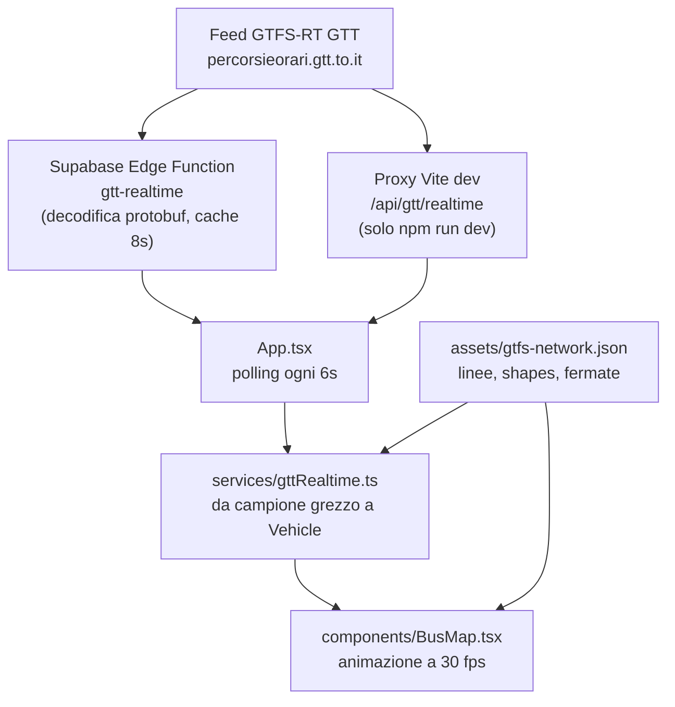

# BusRadar · riferimento di progetto

Questo è il documento da leggere per primo prima di toccare BusRadar, sia per Claude Code sia per Codex. Serve a due cose: capire com'è fatto il progetto senza rileggere tutto il codice, e verificare in che stato si trova prima di proporre una modifica.

Gli altri documenti restano validi e più specifici:

| documento | contenuto |
| --- | --- |
| [`AGENTS.md`](../AGENTS.md) | regole operative per gli agenti, controlli obbligatori, sicurezza |
| [`docs/cloud-workflow.md`](cloud-workflow.md) | flusso GitHub, lavoro in tandem, uso da iPhone |
| [`README.md`](../README.md) | presentazione del progetto e note legali |
| [`README_REALTIME.md`](../README_REALTIME.md) | strumenti e checklist per il realtime |
| [`docs/gtfs-static-validation.md`](gtfs-static-validation.md) | validazione del GTFS statico GTT |
| [`docs/product-spec-v0.1.md`](product-spec-v0.1.md) | specifica storica della v0.1, **superata** (vedi «Incoerenze note») |

Ultimo allineamento di questo documento: 2026-08-09, versione applicativa v0.2.31.

---

## 1. Cos'è BusRadar oggi

Webapp standalone mobile-first che mostra i mezzi GTT di Torino su mappa, in stile live transit map. Non è un servizio ufficiale GTT, MaTO, 5T o del Comune di Torino: i dati realtime sono letti in modalità civic-tech tramite un proxy tecnico.

- **Stack**: React 19, TypeScript, Vite 6, MapLibre GL 5, CSS custom. Nessun framework CSS, nessuno state manager esterno.
- **Posizioni mezzi**: GTFS-RT Vehicle Positions GTT, tramite Supabase Edge Function.
- **Rete (linee, tracciati, fermate)**: GTFS statico GTT, pre-elaborato in JSON e servito come asset.
- **Backend**: solo due Edge Function Supabase. Nessun database, nessuna sessione, nessuna autenticazione.
- **Scraping**: assente. Nessun endpoint privato, nessuna chiave nel repository.
- **Deploy**: GitHub Pages su `https://trailpress.github.io/BusRadar/`.

---

## 2. Architettura e flusso dei dati



Il passaggio che conta davvero, e dove si concentrano quasi tutti i bug visivi, è la catena **campione grezzo → `Vehicle` → fotogramma animato**.

### 2.1 Dal feed al `Vehicle`

Tutto in `frontend/src/services/gttRealtime.ts`, funzione `toVehicle`.

1. **Identità**: `vehicleId` normalizzato da `vehicle.id` o `vehicle.label`; il numero di parco viene riconosciuto solo se compatibile con il catalogo flotta, altrimenti il mezzo resta «modello non identificato».
2. **Velocità** (`observedSpeed`): si preferisce la velocità del feed; se assente si calcola dallo spostamento tra due campioni, accettando solo intervalli tra 5 e 180 s e velocità sotto 90 km/h.
3. **Aggancio alla shape** (`terminalEstimate`): tra le varianti GTFS della linea si sceglie quella che minimizza distanza dal punto e scarto di direzione, con un forte bonus di permanenza sulla shape già in uso. Il mezzo è considerato agganciato entro 55 m (70 m per gli extraurbani blu).
4. **Compensazione della latenza** (`compensateFeedLatency`): se agganciato, il punto viene proiettato in avanti lungo la shape per recuperare l'età del campione. Vedi §4.
5. **Uscita**: posizione finale, bearing, progresso sulla linea, capolinea stimato, ETA, previsioni di fermata dai Trip Update.

### 2.1.1 Arrivi alle paline

Gli arrivi mostrati toccando una palina vengono da `fetchGttStopArrivalsInfo`, che unisce due fonti: i Trip Update GTFS-RT e, per le linee senza dato realtime, gli orari programmati del GTFS statico.

L'aggancio di un orario alla palina giusta segue una gerarchia precisa, e va rispettata:

1. Se l'aggiornamento porta un `stopId` esplicito, quello decide, **anche in negativo**: un id diverso significa un'altra fermata.
2. Altrimenti si risolve la `stopSequence` sul trip statico e si confronta l'id ottenuto.
3. Solo se nulla risolve la sequenza si può ricadere sull'ordinale.

Il terzo passo è un ripiego, mai un'alternativa ai primi due. Una palina occupa in media 1,29 posizioni diverse sulla stessa linea, e fino a 9 nei casi peggiori, perché le sequenze di tutte le varianti e di entrambe le direzioni finiscono sotto la stessa chiave. Trattare l'ordinale come prova di identità faceva comparire alla palina gli orari di altre fermate della stessa linea.

Gli orari programmati passano poi dal calendario di servizio (`serviceRunsToday`): senza quel filtro la stessa corsa comparirebbe più volte, una per ogni calendario che la definisce.

### 2.2 Dal `Vehicle` al movimento sulla mappa

Tutto in `frontend/src/components/BusMap.tsx`.

Il polling produce campioni ogni 6 secondi, ma il feed GTT è tipicamente vecchio di circa un minuto. Il marker non salta da un campione all'altro: ogni aggiornamento apre un **fotogramma** (`VehicleFrame`) con posizione di partenza, arrivo e durata, e un loop `requestAnimationFrame` a 30 fps interpola tra i due.

- Se il mezzo è agganciato a una shape, l'interpolazione avviene **lungo il tracciato** (`routeMotion` + `interpolatePathState`), non in linea retta. Il bearing viene dalla geometria.
- `routeMotion` impedisce per costruzione la marcia indietro: il progresso non scende mai sotto quello già mostrato.
- Se non c'è aggancio, l'interpolazione è punto a punto e vale la protezione dal rumore GPS descritta in §4.

---

## 3. Mappa del repository

```text
BusRadar/
├── AGENTS.md                    istruzioni persistenti per gli agenti
├── README.md · README_REALTIME.md
├── docs/                        questo documento e gli altri riferimenti
├── .github/workflows/
│   ├── ci.yml                   Verify BusRadar, su ogni pull request
│   ├── deploy-pages.yml         build e pubblicazione, su push in main
│   └── generate-tram-serie-5000-render.yml   render flotta, manuale
├── .devcontainer/               workspace GitHub Codespaces
├── supabase/functions/
│   ├── gtt-realtime/            proxy GTFS-RT pubblico
│   └── route-preview-config/    chiavi vista strada a runtime
└── frontend/
    ├── vite.config.ts           base /BusRadar/ + proxy realtime di sviluppo
    ├── scripts/                 generazione dati e verifiche
    ├── public/assets/           asset statici e dataset GTFS generati
    └── src/
```

### Dove intervenire, per tipo di modifica

| se devi toccare | vai in |
| --- | --- |
| movimento, animazione, marker, freccia, layer mappa | `src/components/BusMap.tsx` |
| trasformazione del feed, aggancio shape, ETA, velocità | `src/services/gttRealtime.ts` |
| polling, stato globale, navigazione tra schermate | `src/App.tsx` |
| schermate (mappa, linee, vetture, fermate, radar) | `src/screens/` |
| scheda vettura e dettaglio linea | `src/components/VehicleSheet.tsx`, `src/screens/LineDetailScreen.tsx` |
| riconoscimento flotta, livree, render dei mezzi | `src/data/gttFleetCatalog.ts`, `src/data/vehicleFleet*.ts` |
| calcoli geografici (distanza, bearing, progresso su path) | `src/utils/geo.ts` |
| vista strada lungo il percorso | `src/components/RouteStreetViewPlayer.tsx` |
| dataset GTFS statico | `scripts/generate-gtfs-network.mjs` |

### File più densi

`BusMap.tsx` è di gran lunga il file più grande del progetto e contiene sia la logica di animazione sia la definizione di tutti i layer MapLibre. `gttRealtime.ts` contiene l'intera trasformazione del feed. Sono i due punti in cui una modifica affrettata fa più danni.

---

## 4. Parametri di taratura del movimento

Sono i numeri che decidono quanto il movimento appare realistico. Vanno cambiati uno alla volta, verificando l'effetto sulla mappa reale: sono stati scelti in equilibrio tra loro.

### In `services/gttRealtime.ts`

| costante o soglia | valore | effetto |
| --- | --- | --- |
| `MAX_LATENCY_COMPENSATION_SECONDS` | 75 s | quanta età del campione viene recuperata proiettando in avanti |
| `MAX_LATENCY_COMPENSATION_METERS` | 700 m | tetto assoluto alla proiezione |
| `LATENCY_COMPENSATION_CONFIDENCE` | 0,85 | margine contro l'overshoot: la stima assume velocità costante, il mezzo invece frena |
| bonus di permanenza sulla shape | −95 entro 140 m | evita che andata e ritorno si scambino tra un campione e l'altro |
| `snapLimitMeters` | 55 m, 70 m extraurbani | oltre questa distanza il mezzo non è agganciato alla shape |
| soglia velocità per la compensazione | 3–75 km/h | fuori da questa fascia non si proietta |

La compensazione è limitata anche dalla distanza residua al capolinea: un mezzo non viene mai proiettato oltre la fine della sua corsa.

### In `components/BusMap.tsx`

| costante o soglia | valore | effetto |
| --- | --- | --- |
| `maxPlaybackSpeedMps` | 13,9 m/s tram · 15,3 m/s bus | velocità massima con cui un marker può essere animato |
| margine di recupero | 1,35× la velocità reale, minimo 5,5 m/s | quanto può «rincorrere» un marker rimasto indietro |
| `isPlausibleUpdate` | 900 m | oltre questa distanza il campione è trattato come teletrasporto e il marker salta |
| `isPositionJitter` | < 12 m con velocità < 3 km/h | i mezzi senza shape tengono la posizione invece di ballare sul rumore GPS |
| soglia marcia indietro in `routeMotion` | −10 m | sotto questa soglia il progresso resta fermo invece di tornare indietro |
| throttle di rendering | 33 ms | circa 30 fps per la sorgente dei mezzi |
| `ARROW_OFFSET_EMS` | 1,24 | distanza della freccia dal badge, in em |

**Regola pratica.** Se i mezzi sembrano accelerare in modo innaturale, il problema è quasi sempre nella durata del playback, non nella compensazione. Se sembrano andare all'indietro, guarda prima l'aggancio alla shape e poi la compensazione. Se la freccia confonde, guarda `hasReliableHeading` e l'offset.

---

## 5. Dati GTFS statici

Il GTFS statico GTT viene pre-elaborato **fuori dalla build** e committato come asset.

```bash
cd frontend
GTFS_STATIC_DIR=/percorso/gtfs/estratto npm run gtfs:generate
```

Produce `public/assets/gtfs-network.json` (linee, varianti, shapes, fermate) e `public/assets/gtfs-stop-times.json` (indice degli orari programmati).

Stato attuale, verificato da `npm run verify:routes`: **223 linee, 894 direzioni, 894 varianti GTFS**, nessuna direzione sostituita da un duplicato più corto.

I due dataset pesano circa **6 MB** e **42 MB**. Sono entrambi versionati nel repository. Vanno rigenerati solo quando GTT pubblica un feed nuovo, e la rigenerazione va accompagnata da un aggiornamento di `docs/gtfs-static-validation.md`.

> ⚠️ Non sostituire mai geometrie GTFS verificate con coordinate inventate. È una regola esplicita di `AGENTS.md`.

---

## 6. Comandi e verifiche

Tutti da `frontend/`.

| comando | a cosa serve |
| --- | --- |
| `npm ci` | installazione riproducibile delle dipendenze |
| `npm run dev` | sviluppo su `localhost:5173`, con proxy realtime integrato |
| `npm run build` | typecheck TypeScript più build di produzione |
| `npm run verify:assets` | ogni asset citato nei cataloghi esiste in `public/assets` |
| `npm run verify:routes` | integrità delle varianti GTFS e delle direzioni |
| `npm run gtfs:generate` | rigenera i dataset GTFS statici |
| `npm run realtime:spike` | ispeziona il feed GTFS-RT senza passare dalla UI |
| `npm run preview` | serve la build compilata |

### Verificare in che stato è il progetto

Prima di proporre qualsiasi modifica:

```bash
git fetch origin main && git log --oneline origin/main -10
cd frontend && npm ci
npm run verify:assets && npm run verify:routes && npm run build
```

Attesi: 58 riferimenti ad asset verificati, 223 linee e 894 varianti verificate, build completata. Poi controlla su GitHub che non ci siano pull request aperte di un altro agente e che l'ultimo deploy da `main` sia riuscito.

Per una modifica all'interfaccia, `npm run dev` e controllo delle viste desktop e mobile interessate: le verifiche automatiche non vedono nulla di visivo.

---

## 7. Realtime, ambienti e deploy

**In sviluppo** `vite.config.ts` espone `/api/gtt/realtime`, che scarica il feed GTT server-side con `curl` (Node fetch ha problemi di DNS con quell'host IIS legacy) e lo decodifica.

**In produzione** il frontend chiama la Edge Function `gtt-realtime`, che scarica il protobuf, lo decodifica e lo serve come JSON con CORS aperto e cache di 8 secondi. L'URL di base è sovrascrivibile con `VITE_REALTIME_API_BASE`.

La funzione `route-preview-config` fornisce a runtime le chiavi della vista strada, con origini limitate a `trailpress.github.io` e al localhost di sviluppo. Serve a tenere le chiavi fuori dal bundle pubblico.

**Deploy.** Ogni push in `main` avvia `deploy-pages.yml`, che ripete le stesse verifiche della CI e pubblica `frontend/dist` su GitHub Pages. Il `base` di Vite è `/BusRadar/`: un percorso diverso rompe tutti gli asset. `npm run deploy` esiste ma è solo una procedura di emergenza e non fa parte del flusso ordinario.

---

## 8. Sicurezza

- Mai committare chiavi API, token, password, URL di feed privati o file `.env`.
- Mai mettere valori privati in variabili `VITE_*`: finiscono nel bundle visibile nel browser.
- Le credenziali di Google, Mapillary e delle altre anteprime di percorso stanno nei secret delle Edge Function Supabase.
- Le credenziali di deploy stanno nei secret di repository o environment di GitHub.
- `frontend/.env.example` contiene solo segnaposto vuoti e configurazione pubblica.

---

## 9. Incoerenze note e debito tecnico

Da conoscere prima di fidarsi di quello che si legge nel repository.

1. **`docs/product-spec-v0.1.md` è storico.** Descrive Leaflet, dati simulati e nessun backend. Il progetto usa MapLibre, dati GTT reali e due Edge Function. Va letto come documento d'origine, non come stato attuale.
2. **`frontend/.env.example` è disallineato.** Dice che «la UI di produzione usa ancora `SimulationAdapter`»: non è più vero, la UI realtime passa da `gttRealtime.ts`. `SimulationAdapter` resta solo come adapter locale di sviluppo.
3. **`gtfs-stop-times.json` pesa 42 MB e viene scaricato al primo polling**, dentro la stessa `Promise.all` che recupera i mezzi. Blocca quindi il primo rendering dei veicoli, non solo le previsioni di fermata. È il candidato più ovvio per un intervento di performance.
4. **Il chunk `RouteDirectionSelector` supera 1 MB** e la build lo segnala a ogni esecuzione. L'avviso è atteso, non è una regressione.
5. **La versione applicativa è scritta a mano in due punti**, `src/components/AppHeader.tsx` e `src/screens/MoreScreen.tsx`. Vanno aggiornati insieme, altrimenti l'app mostra due versioni diverse.
6. **L'overlay HTML dei marker è disattivato.** `syncVehicleOverlay` nasconde tutto e ignora i parametri: l'unico rendering attivo dei mezzi passa dai layer MapLibre. Non aggiungere logica all'overlay pensando che sia visibile.

---

## 10. Checklist per una modifica

1. Parti da `main` aggiornato e leggi gli ultimi commit: un altro agente potrebbe aver già fatto il lavoro.
2. Apri un ramo con il tuo prefisso, `codex/*` o `claude/*`.
3. Fai una modifica sola e mirata. Le pull request lunghe sono quelle che entrano in conflitto tra agenti.
4. Esegui `npm run verify:assets`, `npm run verify:routes` e `npm run build`.
5. Se hai toccato l'interfaccia, guardala davvero con `npm run dev`.
6. Se hai toccato i layer MapLibre, validali con il validatore dello style spec: un'espressione sbagliata non fallisce la build, fallisce a runtime nel browser.
7. Apri la pull request, aspetta `Verify BusRadar` e dichiara nel testo cosa **non** hai potuto verificare.
8. Se la decisione presa deve sopravvivere alla sessione, scrivila qui o in `AGENTS.md`: il prossimo agente parte senza la tua conversazione.
